# 🏗️ Desafio Fullstack Integrado
🚨 Instrução Importante (LEIA ANTES DE COMEÇAR)
❌ NÃO faça fork deste repositório.

Este repositório é fornecido como modelo/base. Para realizar o desafio, você deve:
✅ Opção correta (obrigatória)
  Clique em “Use this template” (se este repositório estiver marcado como Template)
OU
  Clone este repositório e crie um NOVO repositório público em sua conta GitHub.
📌 O resultado deve ser um repositório próprio, independente deste.

## 🎯 Objetivo
Criar solução completa em camadas (DB, EJB, Backend, Frontend), corrigindo bug em EJB e entregando aplicação funcional.

## 📦 Estrutura
- db/: scripts schema e seed
- ejb-module/: serviço EJB com bug a ser corrigido
- backend-module/: backend Java 8+
- frontend/: app Angular
- docs/: instruções e critérios
- .github/workflows/: CI

## ✅ Tarefas do candidato
1. Executar db/schema.sql e db/seed.sql
2. Corrigir bug no BeneficioEjbService
3. Implementar backend CRUD + integração com EJB
4. Desenvolver frontend Angular consumindo backend
5. Implementar testes
6. Documentar (Swagger, README)
7. Enviar link para recrutadora com seu repositório para análise

## 🐞 Bug no EJB
- Transferência não verifica saldo, não usa locking, pode gerar inconsistência
- Espera-se correção com validações, rollback, locking/optimistic locking

## 📊 Critérios de avaliação
- Arquitetura em camadas (20%)
- Correção EJB (20%)
- CRUD + Transferência (15%)
- Qualidade de código (10%)
- Testes (15%)
- Documentação (10%)
- Frontend (10%)

# 🚀 Atividades Realizadas

## 🐞 Correção do Bug no EJB

Problemas corrigidos:

- Validação de saldo insuficiente
- Controle transacional
- Locking pessimista para evitar concorrência
- Prevenção de inconsistência e lost update
- Validações de transferência

---

## ✅ Melhorias implementadas

- Arquitetura em camadas
- CRUD completo
- Integração Backend + EJB
- Controle transacional
- Locking pessimista
- Tratamento de exceções
- Execução automática de scripts SQL
- Documentação Swagger
- Testes automatizados
- README detalhado
- Implementação do frontend
- Deploy público frontend + backend

## 🔀 Fluxo Git utilizado

O desenvolvimento foi realizado na branch `dev`, com integração final para a branch `main` por meio de Pull Request.

A branch `main` contém a versão final da entrega.

## ✅ Scripts executados automaticamente

Os scripts abaixo são executados automaticamente na inicialização da aplicação:

- `db/schema.sql`
- `db/seed.sql`

---

# 🔧 Backend Java

Tecnologias utilizadas no BackEnd:

- Java 17
- Spring Boot 3
- Spring Data JPA
- H2 Database
- Swagger / OpenAPI
- Maven
- Angular
- EJB
- JUnit / Mockito

---

# ▶️ Como executar o Backend

## Build do Backend

```bash
mvn clean install
```

## Executar o Backend

```bash
mvn -pl backend-module spring-boot:run
```

---

# 📷 Evidência - Inicialização da API

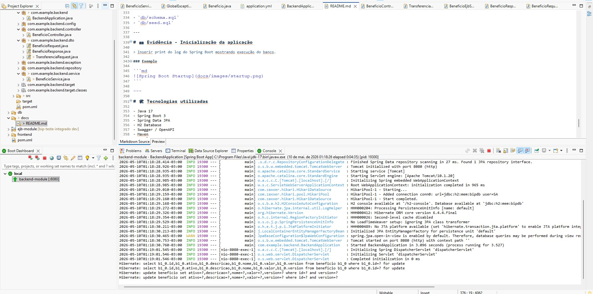

# 🗄️ Banco H2

Acesse o console:

```text
http://localhost:8080/h2-console
```

## Configuração da conexão

| Campo     | Valor              |
|------------|--------------------|
| JDBC URL  | jdbc:h2:mem:bipdb |
| User Name | sa                 |
| Password  | *(vazio)*          |

Após conectar, será possível visualizar as tabelas criadas automaticamente pelos scripts:

- `schema.sql`
- `seed.sql`

---

# 📷 Evidências - Banco H2

## Console H2

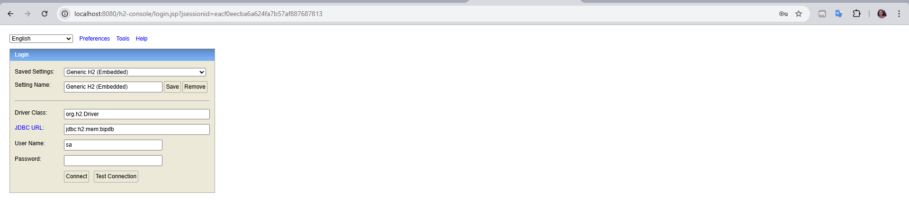

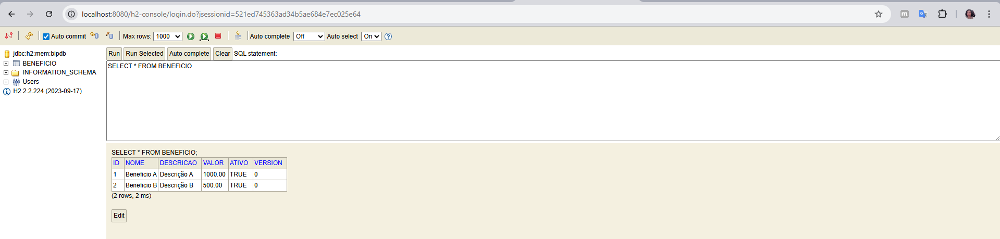

---

# 📘 Swagger / OpenAPI

Com o backend em execução, acesse:

```text
http://localhost:8080/swagger-ui.html
```

## OpenAPI JSON

```text
http://localhost:8080/v3/api-docs
```

---

# 📷 Evidências - Swagger

## Swagger UI

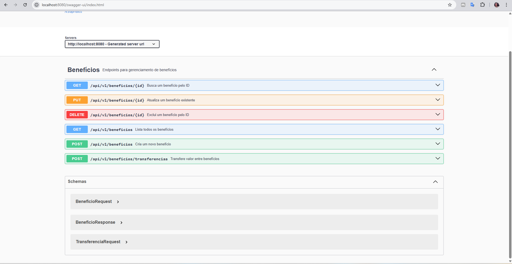

---

# 🔌 Endpoints principais

## Benefícios

```http
GET /api/v1/beneficios
POST /api/v1/beneficios
PUT /api/v1/beneficios/{id}
DELETE /api/v1/beneficios/{id}
```

## Transferências

```http
POST /api/v1/beneficios/transferencias
```

---

# 🧪 Testando a API via Postman

## Base URL

```text
http://localhost:8080
```

---

## 🔍 Listar benefícios

### Request

```http
GET http://localhost:8080/api/v1/beneficios
```

### 📷 Evidência esperada

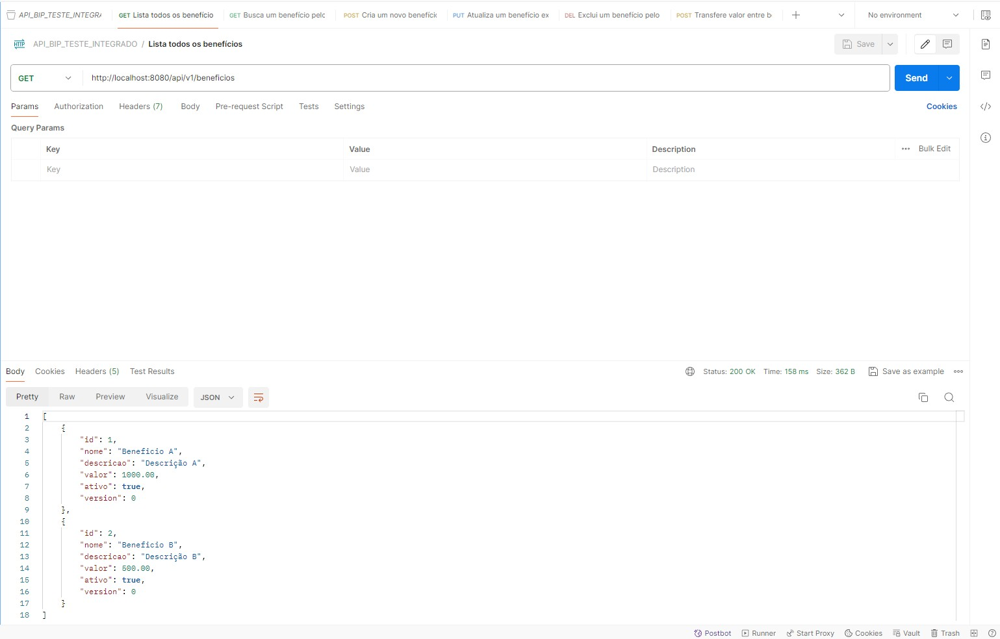

---

## 🔍 Buscar benefício por ID

### Request

```http
GET http://localhost:8080/api/v1/beneficios/1
```

### 📷 Evidência esperada

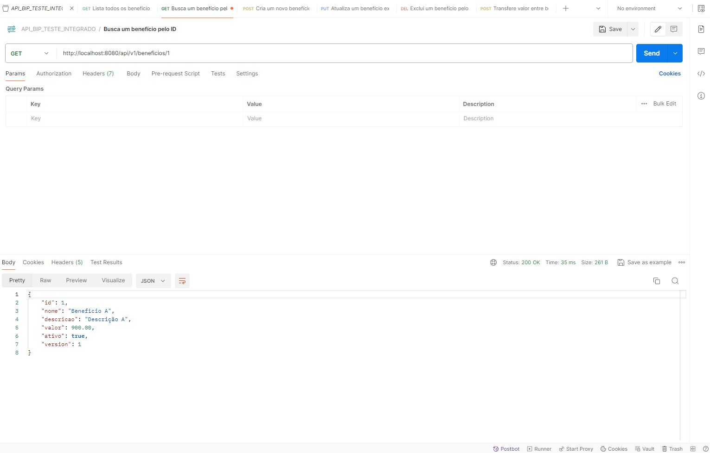

---

## ➕ Criar benefício

### Request

```http
POST http://localhost:8080/api/v1/beneficios
```

### Headers

```text
Content-Type: application/json
```

### Body

```json
{
  "nome": "Vale Alimentação",
  "descricao": "Benefício mensal",
  "valor": 500.00,
  "ativo": true
}
```

### 📷 Evidência esperada

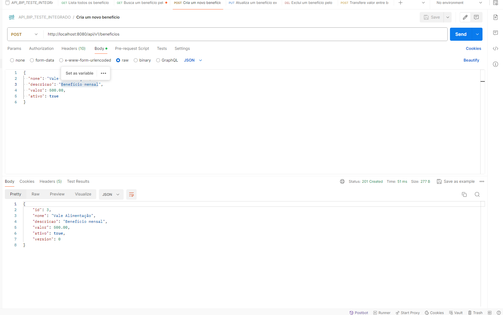

---

## ✏️ Atualizar benefício

### Request

```http
PUT http://localhost:8080/api/v1/beneficios/3
```

### Body

```json
{
  "nome": "Vale Refeição",
  "descricao": "Benefício atualizado",
  "valor": 750.00,
  "ativo": true
}
```

### 📷 Evidência esperada

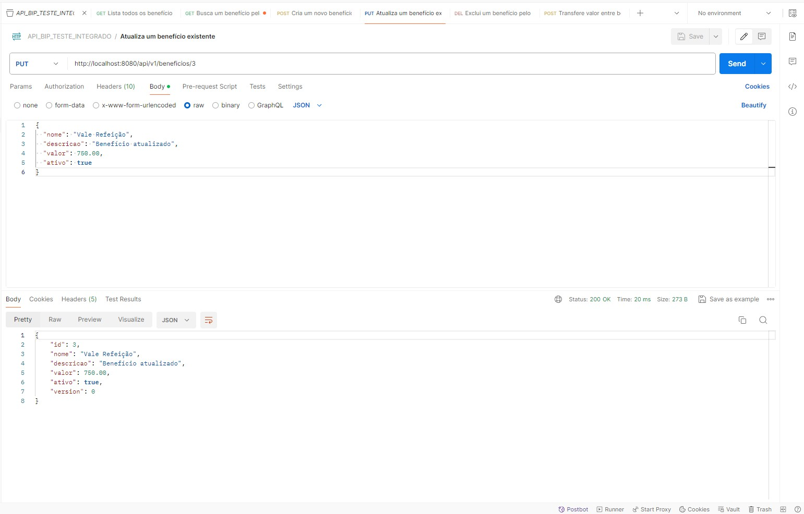

---

## ❌ Remover benefício

### Request

```http
DELETE http://localhost:8080/api/v1/beneficios/3
```

### 📷 Evidência esperada

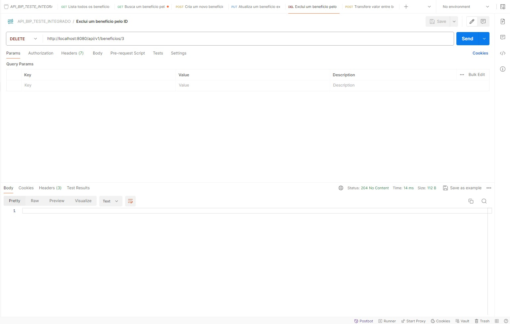

---

## 💸 Transferência entre benefícios

### Request

```http
POST http://localhost:8080/api/v1/beneficios/transferencias
```

### Body

```json
{
  "fromId": 1,
  "toId": 2,
  "amount": 100.00
}
```

### 📷 Evidência esperada

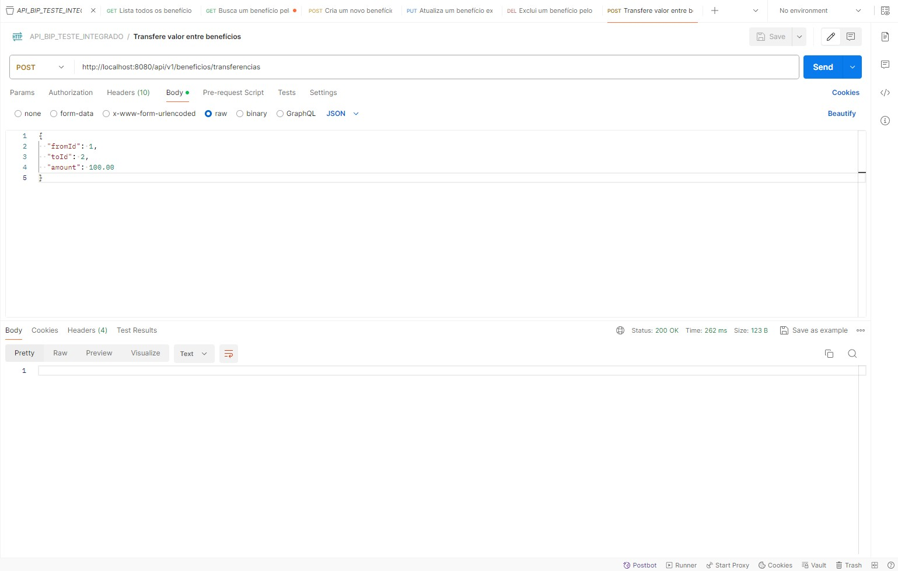

---

# 🖥️ Frontend Angular

Foi implementado um frontend Angular moderno, responsivo e integrado ao backend Spring Boot, consumindo os endpoints de benefícios e transferências.

## 🛠️ Tecnologias utilizadas no Frontend

- Angular 20
- TypeScript
- Bootstrap 5
- Bootstrap Icons
- Reactive Forms
- Signals / Computed
- Chart.js / ng2-charts
- ngx-mask
- SweetAlert2
- Jasmine / Karma

---

## ✅ Funcionalidades implementadas no Frontend

- Dashboard inicial com indicadores
- Cards com total de benefícios, benefícios ativos e valor total
- Gráficos com Chart.js
- Listagem moderna de benefícios
- Busca por nome, descrição, valor ou status
- Ordenação por colunas
- Paginação
- Badges de status
- Visualização detalhada de benefício
- Cadastro de benefício via modal
- Edição de benefício via modal
- Exclusão com confirmação visual
- Tela de transferência entre benefícios
- Validação de saldo
- Formulários reativos com validação visual
- Máscara monetária
- Loading state
- Layout responsivo

---

# ▶️ Como executar o Frontend

Acesse a pasta do frontend:

```bash
cd frontend
```

Instale as dependências:

```bash
npm install
```

Execute a aplicação:

```bash
ng start
```

Acesse:

```text
http://localhost:4200
```

---

# 🧪 Testes unitários do Frontend

Para executar os testes unitários:

```bash
ng test
```

Para executar uma única vez em modo headless:

```bash
ng test --watch=false --browsers=ChromeHeadless
```

Para gerar cobertura:

```bash
ng test --watch=false --browsers=ChromeHeadless --code-coverage
```

---

# 📷 Evidências - Frontend Angular

## Dashboard

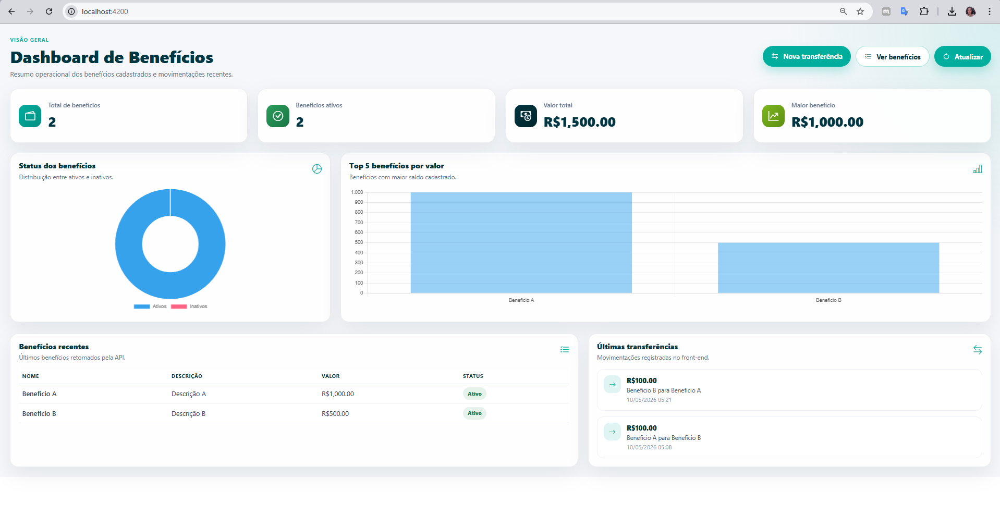

---

## Listagem de Benefícios

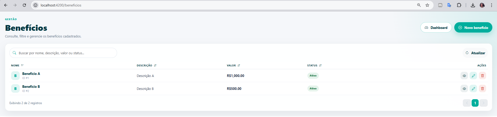

---

## Modal de Cadastro de Benefício

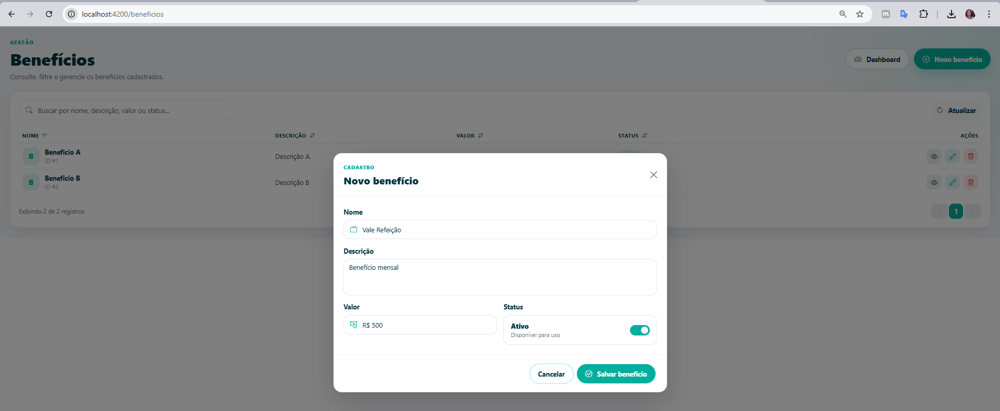

---

## Modal de Edição de Benefício

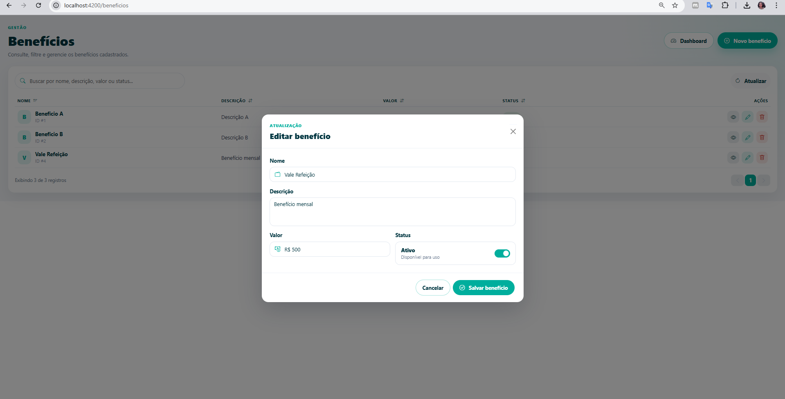

---

## Modal de Visualização de Benefício

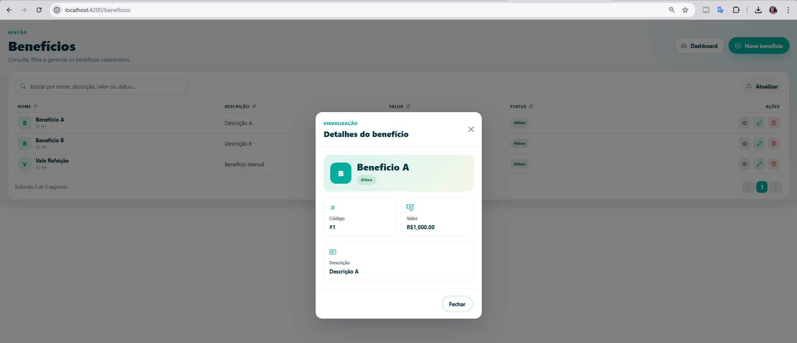

---

## Modal de Exclusão de Benefício

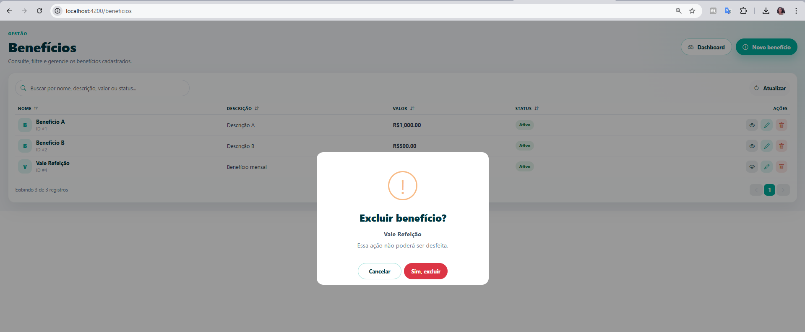

---

## Tela de Transferência

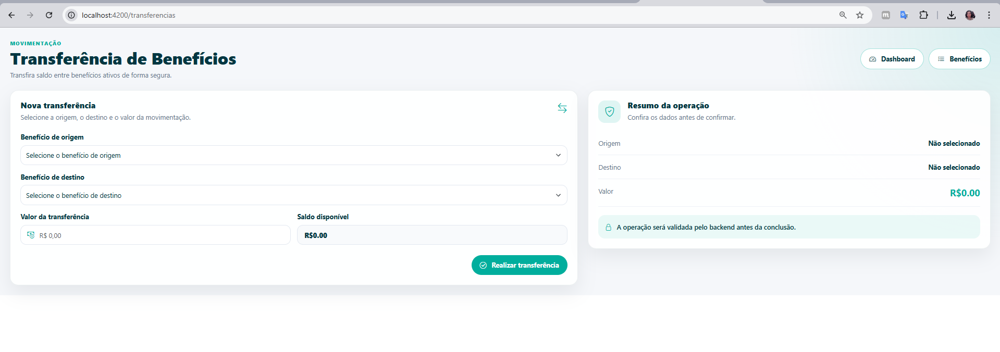

---

## Testes Unitários do Frontend

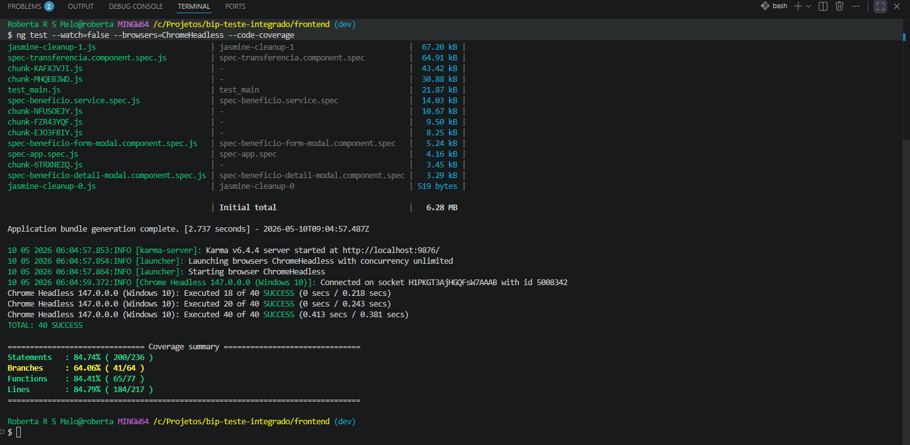

---

# 🔗 Integração Frontend + Backend

O frontend consome os endpoints REST disponibilizados pelo backend:

```http
GET /api/v1/beneficios
POST /api/v1/beneficios
PUT /api/v1/beneficios/{id}
DELETE /api/v1/beneficios/{id}
POST /api/v1/beneficios/transferencias
```

A URL base da API é configurada no arquivo de environment do Angular:

```ts
apiUrl: 'http://localhost:8080/api/v1'
```

---

# 🌐 Aplicação Online

Disponibilização da aplicação fullstack em produção no GitHub Pages(FrontEnd) e Render(backend)

## Frontend

https://robertarenally.github.io/bip-teste-integrado/

## Backend

https://bip-teste-integrado.onrender.com

## Swagger

https://bip-teste-integrado.onrender.com/swagger-ui/index.html

## OpenAPI JSON

https://bip-teste-integrado.onrender.com/v3/api-docs